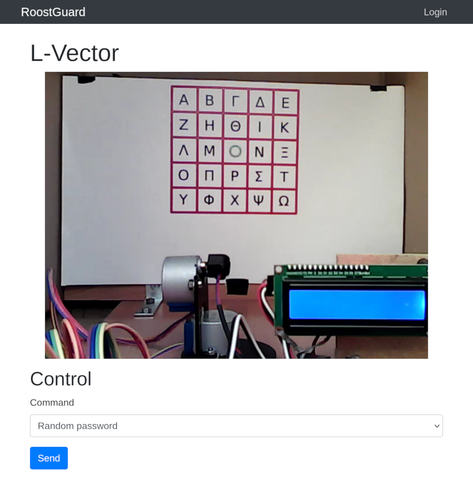

# Chapter 1: Operator (2 points)

Hi, emergency troubleshooter,

recent studies suggest that the intense heat and hard labor of solar
technicians often trigger strange, vivid dreams about the future of energetics.
Over the past few days, technicians have woken up night after night with the
same terrifying screams "Look, up in the sky! It’s a bird! It’s a plane! It’s
Superman! Let’s roast it anyway!".

Find out what’s going on, we need our technicians to stay sane.

Stay grounded!

* http://intro.falcon.powergrid.tcc/

## Hints

* Be sure you enter flag for correct chapter.
* In this realm, challenges should be conquered in a precise order, and to
  triumph over some, you'll need artifacts acquired from others - a unique
  twist that defies the norms of typical CTF challenges.
* Chapter haiku will lead you.

## Solution

When we navigate to http://intro.falcon.powergrid.tcc/ we can see a carousel
with four sections representing individual chapters, accompanied by short poems
containing subtle hints.

Let's focus on the first one:

```text
Soft winds gently blow,
answers drift through open minds —
ease lives in the search.
```

The title leads to http://roostguard.falcon.powergrid.tcc/ where we can see a
login button/form and the `Unauthorized access prohibited` message.

The hint suggests a search, so let's try to discover some content using `dirb`.

```
$ dirb http://roostguard.falcon.powergrid.tcc/

-----------------
DIRB v2.22
By The Dark Raver
-----------------

URL_BASE: http://roostguard.falcon.powergrid.tcc/
WORDLIST_FILES: /usr/share/dirb/wordlists/common.txt

-----------------

GENERATED WORDS: 4612

---- Scanning URL: http://roostguard.falcon.powergrid.tcc/ ----
+ http://roostguard.falcon.powergrid.tcc/command (CODE:405|SIZE:153)
+ http://roostguard.falcon.powergrid.tcc/login (CODE:200|SIZE:2213)
+ http://roostguard.falcon.powergrid.tcc/login_db (CODE:429|SIZE:571)
+ http://roostguard.falcon.powergrid.tcc/login_sendpass (CODE:429|SIZE:571)
+ http://roostguard.falcon.powergrid.tcc/login1 (CODE:429|SIZE:571)
+ http://roostguard.falcon.powergrid.tcc/loginadmin (CODE:429|SIZE:571)
+ http://roostguard.falcon.powergrid.tcc/loginflat (CODE:429|SIZE:571)
+ http://roostguard.falcon.powergrid.tcc/login-redirect (CODE:429|SIZE:571)
+ http://roostguard.falcon.powergrid.tcc/logins (CODE:429|SIZE:571)
+ http://roostguard.falcon.powergrid.tcc/login-us (CODE:429|SIZE:571)
+ http://roostguard.falcon.powergrid.tcc/logout (CODE:302|SIZE:199)
+ http://roostguard.falcon.powergrid.tcc/operator (CODE:200|SIZE:3783)
+ http://roostguard.falcon.powergrid.tcc/stats (CODE:200|SIZE:47)

-----------------
DOWNLOADED: 4612 - FOUND: 13
```

We can see that some endpoints return `429 (Too Many Requests)` error so it
seems there is some rate limitation in place, however, we received `200`
response on the `operator` endpoint which seems to aligh with the chapter name.



There's nothing to do here (yet), however, the source code of the operator form
contains the flag, which we can either see when we inspect the page source code
in the browser or we can retrieve it using `curl`.

```
$ curl -s http://roostguard.falcon.powergrid.tcc/operator | grep -o "FLAG{[a-zA-Z0-9-]*}"
FLAG{AjQ6-NgLU-lQT7-XePG}
```
