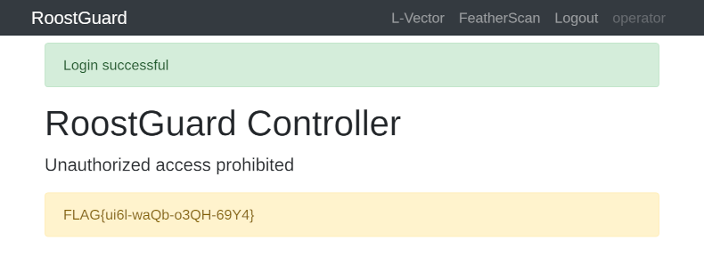

# Chapter 3: Open the door (5 points)

Hi, emergency troubleshooter,

recent studies suggest that the intense heat and hard labor of solar
technicians often trigger strange, vivid dreams about the future of energetics.
Over the past few days, technicians have woken up night after night with the
same terrifying screams "Look, up in the sky! It’s a bird! It’s a plane! It’s
Superman! Let’s roast it anyway!".

Find out what’s going on, we need our technicians to stay sane.

Stay grounded!

* http://intro.falcon.powergrid.tcc/

> NOTE: It turns out that the RoostGuard circuits are not resistant to the
> mating calls’ frequency of local birds, making the online solution somewhat
> unstable. The offline route is the safer bet.

## Hints

* Be sure you enter flag for correct chapter.
* In this realm, challenges should be conquered in a precise order, and to
  triumph over some, you'll need artifacts acquired from others - a unique
  twist that defies the norms of typical CTF challenges.
* Chapter haiku will lead you.

## Solution

We're already familiar with FALCON chapter carousel from [Chapter 1: Operator][ch1]

The third haiku says:

```text
Old lock greets the key,
rusted hinges sing once more —
new paths breathe the fire.
```

The title, similarly to [Chapter 1][ch1], leads to http://roostguard.falcon.powergrid.tcc/.

We have already discovered the `/operator` endpoint in [Chapter 1][ch1] as well
as the `/login` endpoint (no special discovery needed, there's a button on the
main page) which displays a challenge and requires some password.

Since we have completed [Chapter 2][ch2], we should be also able to retrieve
`roostguard-firmware-0.9.bin`.

```
$ file roostguard-firmware-0.9.bin
roostguard-firmware-0.9.bin: ELF 32-bit LSB executable, Atmel AVR 8-bit, version 1 (SYSV), statically linked, with debug_info, not stripped
```

`file` shows us that we're dealing with 32-bit little endian ELF compiled for
AVR microcontrollers (like Arduino), that it is statically linked (i.e. all
libraries are compiled into the binary) and not stripped (i.e. debug symbols
should be present and variable/function names intact).

We can either use `avr-objdump` to disassemble it and/or `avr-nm` to list the
symbols.

```
$ avr-objdump -Sl roostguard-firmware-0.9.bin > firmware.asm
```

After doing either of these, we can identify a list of `process*Command`
functions. `Z` is standard C++ mangling prefix, 18 indicates the length
of a function name, `v` at the end means `void` (no parameters).

```
00002c5c t _Z14processCommandv
00002a66 t _Z18processAIMMCommandv
000023f0 t _Z18processDEMOCommandv
0000251a t _Z18processHOTPCommandv
000021d8 t _Z18processLASECommandv
00002318 t _Z18processPASSCommandv
00002150 t _Z18processTEXTCommandv
0000224c t _Z18processTURRCommandv
00002b3a t _Z18processVERSCommandv
000024ee t _Z18processZEROCommandv
```

Some of them (`PASS`, `VERS`) even directly correlate to what we can see in the
`/operator` endpoint form.

Since we're looking for a password, `HOTP` function should catch our attention.

We can try sending it using info we got from `operator/` (we must include the
session cookie and CSRF token)

```
$ curl http://roostguard.falcon.powergrid.tcc/command -H "Cookie: session=..." -H "X-CSRFToken: ..." -d "command=HOTP" 
{"message":"processed"}
```

After a moment we should see 6-digit access code appearing on the display
on line 2 with line 1 being blank. However, that is not bound to our challenge.
If we were doing this in a busy period, we might have observed that sometimes
the display shows the 6-digit code with a non-empty challenge ID in line 1.

We should come to a conclusion that our HOTP method is missing a parameter, and
the question is, how to send it there.

At this point we have 2 options. The first (and the easiest one) is to take a
look at the `/operator` form, notice that `FIRE` command actually says
`FIRE0000`, so it seems that the arguments come immediately after the 4-char
command (assuming those are some kind of coordinates).

The second (more analytical approach) is to take the disassembled firmware
above, and analyze the `processHOTPCommand` function, or, since we live in AI
world, ask some AI assistant to explain it to us even if we are not fluent in
assembly language.

The analysis should confirm that the `processCommand` copies 16 bytes following
the `HOTP` from the `commandBuffer` to addresses consumed by
`processHOTPCommand`, so we just need to append our challenge to the `HOTP`
command and send it to the server.

```
$ curl http://roostguard.falcon.powergrid.tcc/command -H "Cookie: session=..." -H "X-CSRFToken: ..." -d "command=HOTPmyChallengeX"
{"message":"processed"}
```

After a moment, the correct 6-digit password appears on the screen on the video
feed on the `/operator` page and we can log in without issues.



[ch1]: ../falcon-1-operator
[ch2]: ../falcon-2-the-vendor
