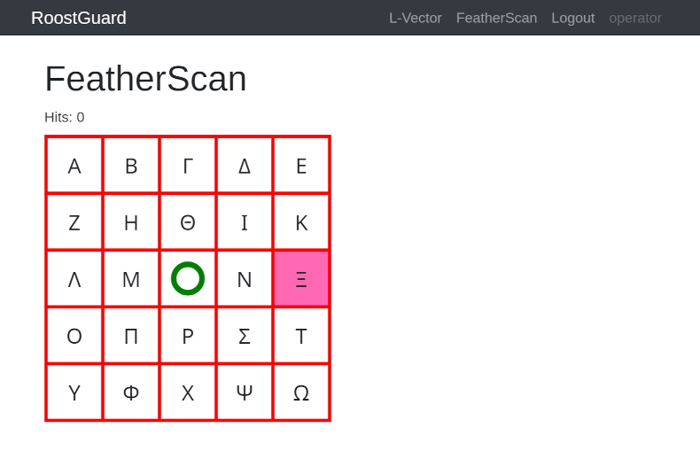
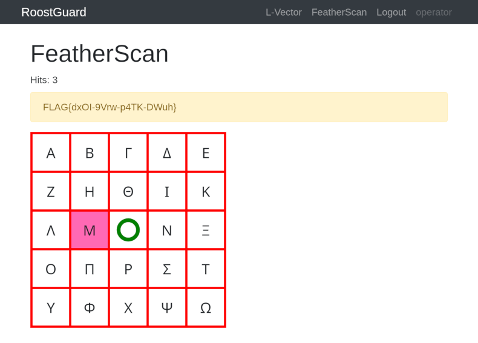

# Chapter 5: Hits (5 points)

Hi, emergency troubleshooter,

recent studies suggest that the intense heat and hard labor of solar
technicians often trigger strange, vivid dreams about the future of energetics.
Over the past few days, technicians have woken up night after night with the
same terrifying screams "Look, up in the sky! It’s a bird! It’s a plane! It’s
Superman! Let’s roast it anyway!".

Find out what’s going on, we need our technicians to stay sane.

Stay grounded!

* http://intro.falcon.powergrid.tcc/

## Hints

* Be sure you enter flag for correct chapter.
* In this realm, challenges should be conquered in a precise order, and to
  triumph over some, you'll need artifacts acquired from others - a unique
  twist that defies the norms of typical CTF challenges.
* Chapter haiku will lead you.

## Solution

We're already familiar with FALCON chapter carousel from [Chapter 1: Operator][ch1]

The final fifth haiku says:

```text
Silent shields arise,
code weaving unseen barriers —
guardians without sleep.
```

The title leads to http://roostguard.falcon.powergrid.tcc/, i.e. to the
RoostGuard Controller page we've already seen in previous chapters, especially
in [Chapter 3][ch3], where we managed to log in and uncovered access to
FeatherScan showing the same grid than in the video, however, with one symbol
highlighted and a text of `Hits: 0`. This suggests we probably need to make the
laser shoot at the highlighted position.



Another benefit of logged-in user is that the `/operator` form now contains a
`Raw command` field, allowing us to send commands to the laser without having
to use `curl` with extracted CSRF token and session cookies.

Sending `Fire` command (i.e. `FIRE0000` value) now also works and (after a
while) we can observe the laser hitting the centre of the board. Our fire
attempts are also marked by the beginning of our session ID being shown in the
first line of the display, so that we can distinguish our attempts from those
of other participants.

Similarly to [Chapter 3][ch3], we can take two paths.

The first one involves experimentation and a "qualified guess". Since the fire
command contains those extra zeroes, we can guess that these actually represent
the coordinates where to fire. By iterative experimentation we can come to the
conclusion that the command structure is `FIRExxyy` because if we slowly
increase the first number (`FIRE0100`, `FIRE0200`, ...) we can see a laser
firing more and more to the right from the centre, increasing a second 2-digit
number causes the laser to fire above the centre. We can also notice a bigger
gap between `09` and `10` and derive that the numbers are in fact hexadecimal,
so `0a` to `0f` fill that gap.

That allows us to target anything in the upper right quadrant, however, we
still need to figure out how to shoot "left" and "down", i.e. to negative
coordinates. Since we've already uncovered that the numbers are hexadecimal,
i.e. the system uses one byte to represent the x-coordinate and another byte to
represent the y-coordinate, we can try representing negative numbers in the
most common way - the [two's complement].

Alternatively, we can take more analytical approach. Since we have the firmware
that we retrieved in [Chapter 2][ch2] and decompiled in [Chapter 3][ch3], we
can check what it does (again, AI assistants might be very valuable to explain
assembly language).

There is no `FIRE` command in the firmware, however there are `AIMM` and `LASE`
operations. The web form handler very likely interprets `FIRE` command as a
composition of aiming and switching the laser on/off.

The analysis confirms the same conclusion we've made above by experimentation.
The `AIMM` command controls the turret targeting system in the firmware. It
accepts two hexadecimal coordinate parameters that specify the X (horizontal)
and Y (vertical) position to aim at.

The command format is `AIMM<XX><YY>` where `<XX>` represents 2 hex digits for X
coordinate and `<YY>` 2 hex digits for Y coordinate. E.g. `AIMM000c` aims at
`X=`0, `Y=+12`.

The `parse()` function (at `0x2a32` in the firmware) converts two hexadecimal
ASCII characters into a signed 8-bit integer and confirms the "educated guess"
about [two's complement] representation.

After parsing, coordinates are clamped, probably to the physical limits of the
turret. The X-axis limit seems to be from -18 to 18 (code at `0x10f8`-`0x110e`)
and the Y-axis (at `0x1112`-`0x1124`) uses the range of -18 to 12.

This gives us the following coordinate system (asymmetrical on Y-axis):

```
        Y-axis (vertical)
            ^ +12 (max)
            |
            |
  -18 <-----+-----> +18  X-axis (horizontal)
  (min)     |     (max)
            |
            v -18 (min)
```

If we overlay this system over the grid of Greek letters, we end up with the
following grid (coordinates should represent the centre of each cell)

|                  | X=-18 (`ee`)     | X=-9 (`f7`)   | X=0 (`00`)     | X=+9 (`09`)    | X=+18 (`12`)     |
| ---------------- | ---------------- | ------------- | -------------- | -------------- | ---------------- |
| **Y=+12 (`0c`)** | Alpha   (`ee0c`) | Beta (`f70c`) | Gamma (`000c`) | Delta (`090c`) | Epsilon (`120c`) |
| **Y=+6  (`06`)** | Zeta    (`ee06`) | Eta  (`f706`) | Theta (`0006`) | Iota  (`0906`) | Kappa   (`1206`) |
| **Y=0   (`00`)** | Lambda  (`ee00`) | Mu   (`f700`) | BLANK (`0000`) | Nu    (`0900`) | Xi      (`1200`) |
| **Y=-9  (`f7`)** | Omicron (`eef7`) | Pi   (`f7f7`) | Rho   (`00f7`) | Sigma (`09f7`) | Tau     (`12f7`) |
| **Y=-18 (`ee`)** | Upsilon (`eeee`) | Phi  (`f7ee`) | Chi   (`00ee`) | Psi   (`09ee`) | Omega   (`12ee`) |

With this information, it is just a matter of issuing the sequence of correct
`FIRExxyy` commands. After 3 successful hits, the FeatherScan page displays the
flag.



[ch1]: ../falcon-1-operator
[ch2]: ../falcon-2-the-vendor
[ch3]: ../falcon-3-open-the-door
[two's complement]: https://en.wikipedia.org/wiki/Two%27s_complement
