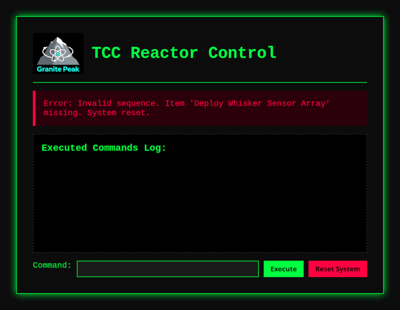
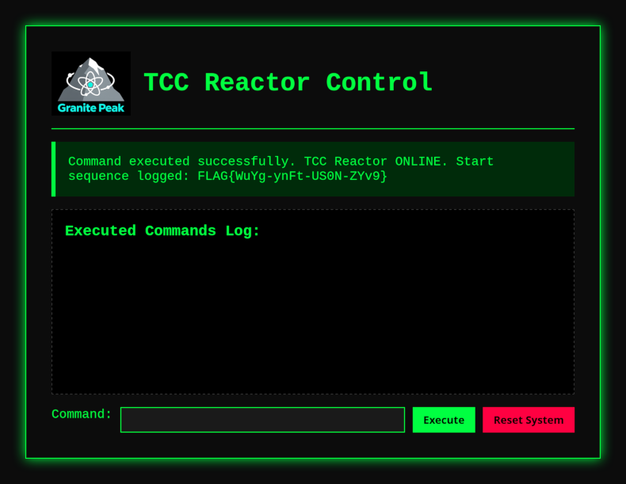

# Reactor startup (1 point)

Hi, trainee,

normally, this task would be assigned to a senior worker, but none are
available now, so your mission will be to start the shut-down reactor at the
Granite Peak Nuclear as quickly as possible — by following the startup
checklist and entering the sequence step by step. However, we have a big
problem: the standard items (e.g., "primary circuit leak test") have somehow
been renamed to nonsense by some cat-holic. Only the first item,
`Initiate Control Circuits`, and the last one, `Phase the Power Plant`, remain
unchanged.

The radiation situation at Granite Peak Nuclear remains normal.

Stay grounded!

Interface for starting sequence is at http://gpn.powergrid.tcc/

## Hints

* All services in powergrid.tcc domain are accessible via VPN only.
* Don’t worry, the reactor has built-in safeguards, so in case of an incorrect
  sequence it will automatically shut down again.
* Some simple automation with a script would be quite handy (doing it manually
  is feasible, but would be a gargantuan task).

## Solution

The provided website shows a UI allowing us to enter some commands. Unknown
commands seem to be handled quite well, so we need to start the sequence with
the one we know is the first one, i.e. `Initiate Control Circuits`. Providing
other/unknown command after that yields no result, but entering the last one
(`Phase the Power Plant`) immediately after the first one yields an error.



The error message reveals the next command in the sequence and now we know the
first two commands and the last one. We can repeat the procedure, or create a
script to do it for us.

```python
import re
import requests

def parse_missing_item(response_text):
    pattern = r"Error: Invalid sequence\. Item &#039;(.*)&#039; missing"
    match = re.search(pattern, response_text)
    return match.group(1) if match else None

def execute_sequence(url, commands):
    session = requests.Session()
    index = 0
    response_text = ""

    while index < len(commands):
        command = commands[index]

        try:
            response = session.post(url, data={'command': command})
            response_text = response.text
            missing_item = parse_missing_item(response_text)

            if missing_item:
                print(missing_item)
                commands.insert(index, missing_item)
                # Restart from the beginning
                index = 0
                session = requests.Session()
            else:
                index += 1

        except requests.RequestException as e:
            print(f"Request failed: {e}")
            break

    match = re.search("(FLAG{.*})", response_text)
    return match.group(1) if match else None

if __name__ == "__main__":
    url = "http://gpn.powergrid.tcc/"
    commands = ["Initiate Control Circuits", "Phase the Power Plant"]
    flag = execute_sequence(url, commands)
    print(f"FLAG: {flag}")
```

When we run the script, it prints out the discovered command sequence along
with the flag.

```
Deploy Whisker Sensor Array
Initiate Cuddle-Heat Exchanger
Prime Catnap Capacitor Bank
Prime Yarn-Ball Cooling Fans
Calibrate Scratch-Post Stabilizer
Enable Laser Pointer Control Panel
Trigger Kibble Fuel Injector
Ignite Catnip Combustion Chamber
Initiate Snuggle Containment Field
Mobilize Paw-Kneading Rhythm Generator
Enable Fur-Static Charge Collector
Calibrate Milk Valve Regulator
Enable Cuddle-Grid Synchronizer
Deploy Nap-Time Auto-Shutdown Relay
Trigger Paw-Print Main Breaker
Deploy Grooming Station
Initiate Meow Frequency Modulator
Tune Purr Resonance Chamber
Engage Harmony Purr Amplifier
Prime Purr Frequency Equalizer
Check Purr-to-Volt Converter Coils
FLAG: FLAG{WuYg-ynFt-US0N-ZYv9}
```

Alternatively, we can enter these commands to UI for the "full UI experience".


