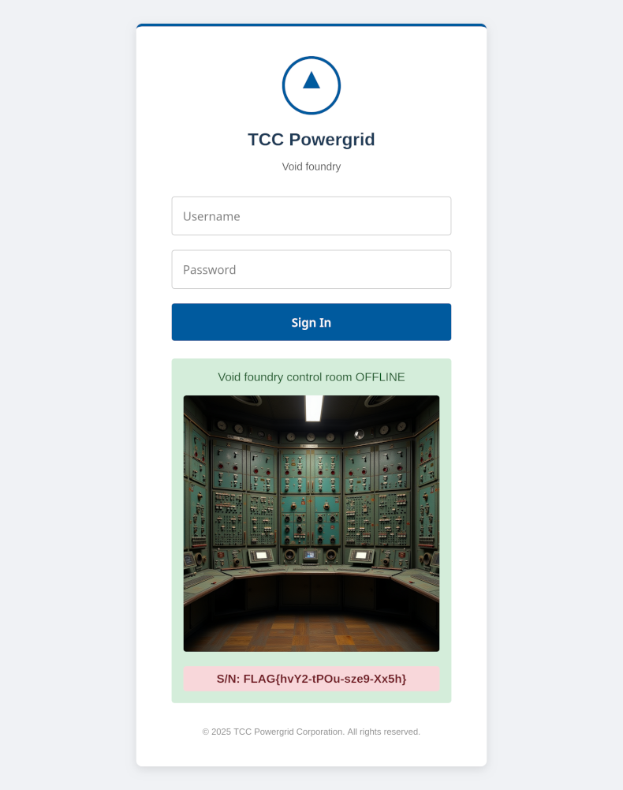

# Void foundry (1 point)

Hi, trainee,

since the TV report about our new elementary particle factory was broadcast, we
have recorded several strange external intrusions. We suspect this may be
connected — check it out.

Stay grounded!

* Watch/download the [TCC News](https://github.com/jandurovec/the-catch-2025/raw/refs/heads/main/void-foundry/void_foundry.mp4)

## Hints

* During TV reports, things often appear on camera that were never meant to be public.
* Nuru has already been saved.
* All services in powergrid.tcc domain are accessible via VPN only.

## Solution

The video (at 01:08) shows a notice board with a link to
http://voidfoundry.powergrid.tcc and another note showing that the login is
`void` and the password is `/dev/null`.

When we open this page in a browser and log in using credentials from the
notice board, we can immediately see the flag.

