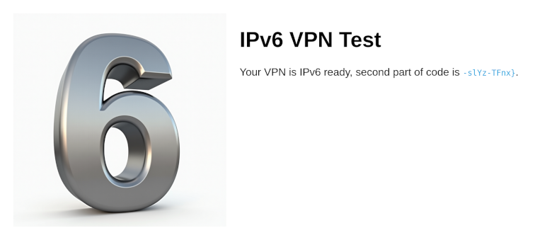

# VPN Test (1 point)

Hi, trainee,

nobody can work secure without [VPN]. You have to install and configure OpenVPN
properly. Configuration file can be downloaded from CTFd's link VPN. Your task
is to activate VPN, visit the testing pages, and get your code proving your
IPv4 and IPv6 readiness.

Stay grounded!

* IPv4 testing page is available at http://volt.powergrid.tcc.
* IPv6 testing page is available at http://ampere.powergrid.tcc.

## Hints

* OpenVPN Install https://openvpn.net/community-resources/installing-openvpn/

## Solution

It is necessary to download OpenVPN configuration file from the provided
address and then start OpenVPN with the provided configuration file.

After connecting to VPN the testing pages become available and each reveals one
half of the flag.

[VPN]: https://www.thecatch.cz/vpn
